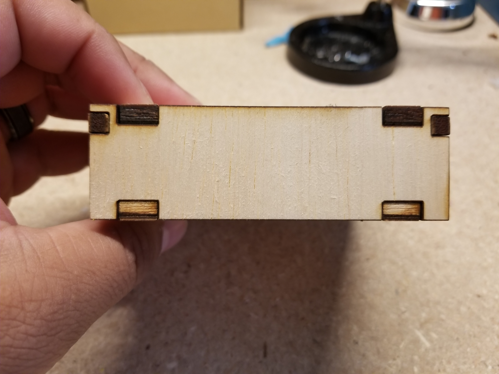
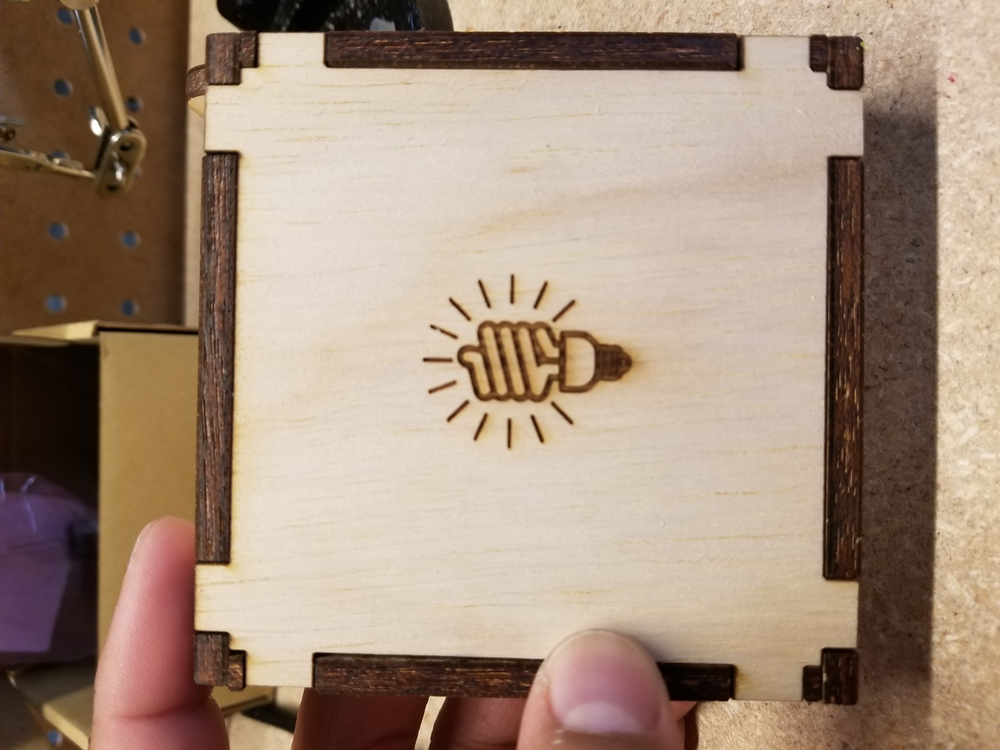
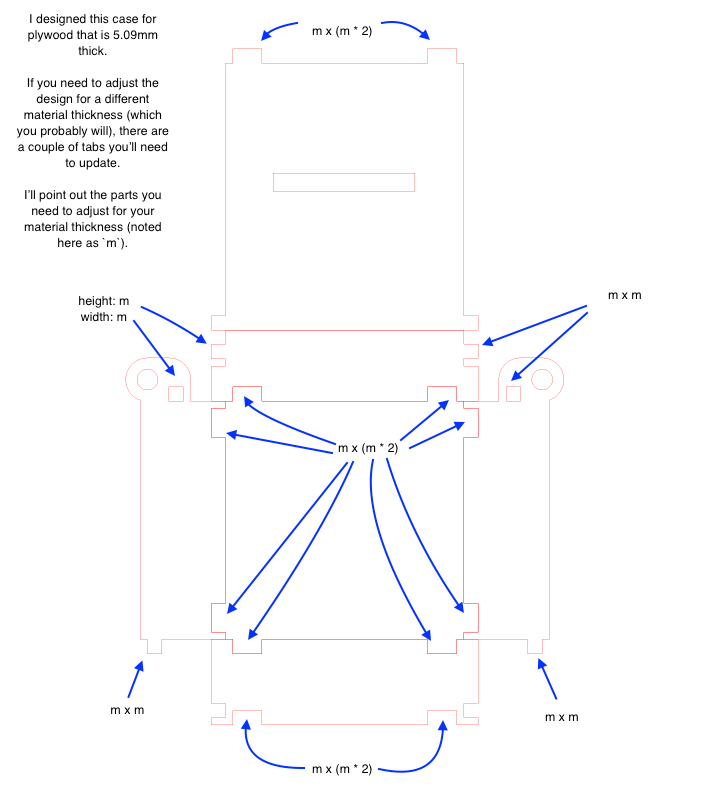
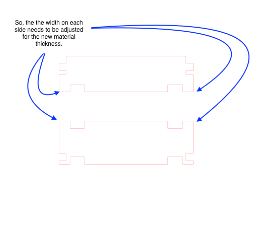
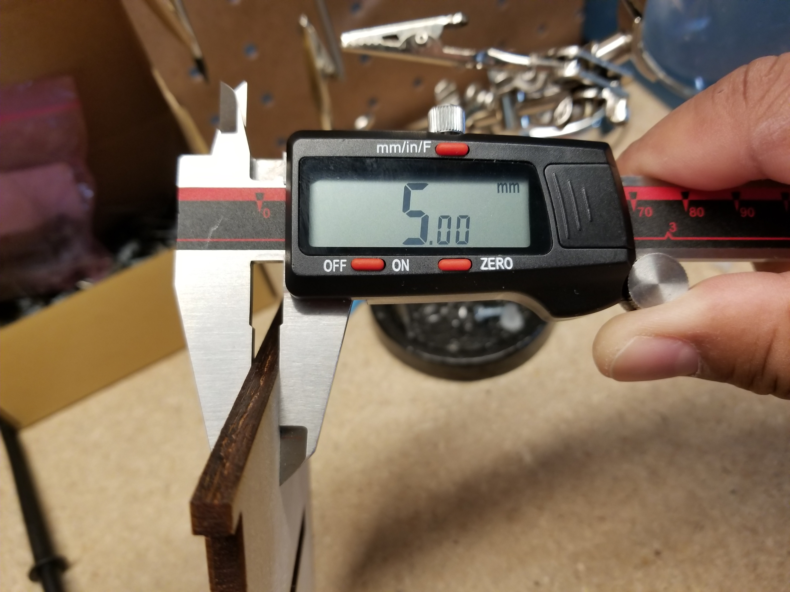

# Acrylic Light

## Overview

This is my take on the LED Acrylic Sign project created by the Ruiz Brothers for Adafruit.

Original project here: https://learn.adafruit.com/led-acrylic-sign/overview

I followed their plan to create my first light and then started expanding from there.

Over the last month or two I've been learning how to use  Adobe Illustrator and laser cutter down at my local [Tech Shop](http://www.techshop.ws/STL.html).

I ended up laser cutting all of my acrylic signs instead of milling them so I thought I'd take another step and laser cut the base as well (the 3d printer we have at work isn't the greatest).

## Accounting for material thickness for the box

An important part of fitting together a laser cut box is accounting for the material thickness. If your design doesn't account for the material you're working with you won't be able to get flush edges when you start assembling the parts.

There are specific sections of the design that you'll need to adjust to account for the material thickness. I'm still getting used to illustrator so I've not been able to set the design up in a manner that allows for easy adjustment of specific sections of shapes (if anyone knows a good way of doing this plz let me know!), but I have annotated the parts of this design that you'll need to adjust.

### Spots you'll need to adjust

- 

- 

The best way that I've found to measure the thickness you'll need is by using a pair of digital calipers:

